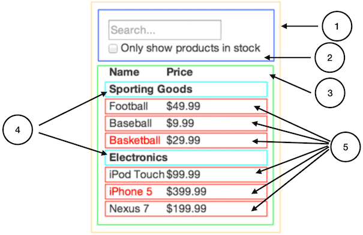

# React 2
## Conditional Rendering
Conditional rendering in React works the same way conditions work in JavaScript. Use JavaScript operators like if or the conditional operator to create elements representing the current state, and let React update the UI to match them.

We’ll create a Greeting component that displays either of these components depending on whether a user is logged in:
```
function Greeting(props) {
  const isLoggedIn = props.isLoggedIn;
  if (isLoggedIn) {
    return <UserGreeting />;
  }
  return <GuestGreeting />;
}

ReactDOM.render(
  // Try changing to isLoggedIn={true}:
  <Greeting isLoggedIn={false} />,
  document.getElementById('root')
);
```
## Lists
Below, we loop through the numbers array using the JavaScript map() function. We return a

- element for each item. Finally, we assign the resulting array of elements to listItems:
```
const numbers = [1, 2, 3, 4, 5];
const listItems = numbers.map((number) =>
  <li>{number}</li>
);
```
## Keys
The best way to pick a key is to use a string that uniquely identifies a list item among its siblings. Most often you would use IDs from your data as keys:
```
const todoItems = todos.map((todo) =>
  <li key={todo.id}>
    {todo.text}
  </li>
);
```
## Forms
In React, a **textarea** uses a value attribute instead. This way, a form using a **textarea** can be written very similarly to a form that uses a single-line input:
```
class EssayForm extends React.Component {
  constructor(props) {
    super(props);
    this.state = {
      value: 'Please write an essay about your favorite DOM element.'
    };

    this.handleChange = this.handleChange.bind(this);
    this.handleSubmit = this.handleSubmit.bind(this);
  }

  handleChange(event) {
    this.setState({value: event.target.value});
  }

  handleSubmit(event) {
    alert('An essay was submitted: ' + this.state.value);
    event.preventDefault();
  }

  render() {
    return (
      <form onSubmit={this.handleSubmit}>
        <label>
          Essay:
          <textarea value={this.state.value} onChange={this.handleChange} />
        </label>
        <input type="submit" value="Submit" />
      </form>
    );
  }
}
```
In HTML, **select** creates a drop-down list. For example, this HTML creates a drop-down list of flavors:
```
<select>
  <option value="grapefruit">Grapefruit</option>
  <option value="lime">Lime</option>
  <option selected value="coconut">Coconut</option>
  <option value="mango">Mango</option>
</select>
```
## Composition vs Inheritance
React has a powerful composition model, and we recommend using composition instead of inheritance to reuse code between components.

**Containment**

Some components don’t know their children ahead of time. This is especially common for components like Sidebar or Dialog that represent generic “boxes”.

We recommend that such components use the special children prop to pass children elements directly into their output:
```
function FancyBorder(props) {
  return (
    <div className={'FancyBorder FancyBorder-' + props.color}>
      {props.children}
    </div>
  );
}
```
## Thinking in React
One of the many great parts of React is how it makes you think about apps as you build them. In this document, we’ll walk you through the thought process of building a searchable product data table using React.

### Start With A Mock
**Step 1:**
Break The UI Into A Component Hierarchy

The first thing you’ll want to do is to draw boxes around every component (and subcomponent) in the mock and give them all names.

But how do you know what should be its own component? Use the same techniques for deciding if you should create a new function or object. One such technique is the single responsibility principle, that is, a component should ideally only do one thing. If it ends up growing, it should be decomposed into smaller subcomponents.



- FilterableProductTable (orange): contains the entirety of the example
- SearchBar (blue): receives all user input
- ProductTable (green): displays and filters the data collection based on user input
- ProductCategoryRow (turquoise): displays a heading for each category
- ProductRow (red): displays a row for each product

**Step 2:**

Build A Static Version in React

Now that you have your component hierarchy, it’s time to implement your app. The easiest way is to build a version that takes your data model and renders the UI but has no interactivity. It’s best to decouple these processes because building a static version requires a lot of typing and no thinking, and adding interactivity requires a lot of thinking and not a lot of typing.

**Step 3:**

Identify The Minimal (but complete) Representation Of UI State

To make your UI interactive, you need to be able to trigger changes to your underlying data model. React achieves this with state.

Think of all the pieces of data in our example application.

We have:

- The original list of products
- The search text the user has entered
- The value of the checkbox
- The filtered list of products

**Step 4:**
           
Identify Where Your State Should Live

For each piece of state in your application:

- Identify every component that renders something based on that state.

- Find a common owner component (a single component above all the components that need the state in the hierarchy).

- Either the common owner or another component higher up in the hierarchy should own the state.

- If you can’t find a component where it makes sense to own the state, create a new component solely for holding the state and add it somewhere in the hierarchy above the common owner component.

**Step 5:**

Add Inverse Data Flow

So far, we’ve built an app that renders correctly as a function of props and state flowing down the hierarchy. Now it’s time to support data flowing the other way: the form components deep in the hierarchy need to update the state in FilterableProductTable.