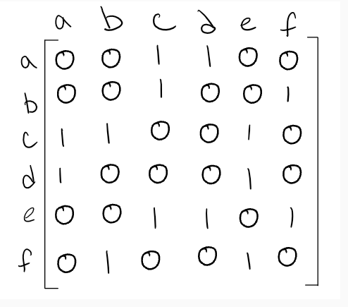

# Graphs
## Terms
- nodes or vertex
- edge: connection between nodes
- neighbor: adjacent node
- degree: number of edges connected to a node
## Structure
- Undirected Graph: edges are bi-directional.
- Directed Graph: Every edge has a direction.
- Complete Graph: All nodes are connected.
- Connected Graph: All nodes have at least 1 edge. Tree.
- Disconnected Graph: Some nodes may not have edges. Floating nodes are ok.
- Acyclic Graph: A graph without cycles. Tree.
- Cyclic Graphs: A graph may return to the original node.

## Representaions
**Adjacency Matrix** 
Each row and column represent each vertex.

**Adjacency List** 
A list of nodes that are connected.

A => c => d B => c => f ...

## Traversals
**Breadth First**
- start at a node
- keep track of visited nodes to prevent an infinite loop
- traverse each node connected to the target node.

**Depth First** 
- create a stack
- put starting node in stack
- if top node has unvisited children, mark as visited and push unvisited children onto the stack.
- if top node does not have unvisited children, pop off.