# summarizing my understanding of relational databases and SQL:
SQL is a powerful query language used to store, manipulate, and retrieving data, and it is one of the most widely used languages by developers to query and analyze data efficiently.

 **What is SQL?**

 It is an abbreviation of the word Structured Query Language and it does not have (If , Select case , Loop , for Next)
 ### Rules:
1- SQL does not differentiate between uppercase and lowercase letters.

2- Whitespace is ignored by SQL.

3-  A semicolon is used at the end of every language sentence (;).

4- In the table or column names, no reserved words should be utilized.

5- Table and column names generally begin with a letter, not a number, and may be followed by numbers.

| Commands | Use it  |
| :-------------: | :----------: |
| CREATE DATABASE | Create database | 
| ALTER DATABASE | Edit database  | 
| CREATE TABLE | Create a table  | 
| ALTER TABLE | Edit table  | 
| DROP TABLE | delete table  | 
| CREATE INDEX | Create an index  | 
|  DROP INDEX | delete index  | 
| SELECT | Query about data  |
| INSERT | add data  |
| UPDATE | Edit data  |
| DELETE | delete data  |

`SELECT column, another_column, …
FROM mytable;`

another form is to have the where (constraints) with the and or and other operators to minimize the search 
`SELECT column, another_column, …
FROM mytable
WHERE condition
    AND/OR another_condition
    AND/OR …;`
 
 

Now here something different appears and thats the **DISTINCT** keyword which only chooses unique rows `SELECT DISTINCT column, another_column, …
FROM mytable
WHERE condition(s);`

**Order By keyword**: orders the data in either ascending or descending and in default it is ascending

#### Limiting results to a subset
We use **Limit** and **offset** which let us limit how many of the rows are read and where to start reading.
`SELECT column, another_column, …
FROM mytable
WHERE condition(s)
ORDER BY column ASC/DESC
LIMIT num_limit OFFSET num_offset;`

 

-------------------------------------------

### Multi-table queries with JOINs

Basically what happens here is that we have to create smaller tables for performance sake instead of one big table and therefore we use **Join** or **INNER JOIN** to connect between 2 tables on something they have in common which is the id.

`SELECT column, another_table_column, …
FROM mytable
INNER JOIN another_table 
    ON mytable.id = another_table.id
WHERE condition(s)
ORDER BY column, … ASC/DESC
LIMIT num_limit OFFSET num_offset;` 
 

**Learning SQL will help me handle databases more effectively and professionally.**

# This is the answers of the book Question:(sql)
### **Q1:**  Fetch the first 8 rows of the albums table?
**Answer:** "SELECT * FROM albums LIMIT 8;"
### **Q2:** Fetch the 12th through 32nd (21 total) rows of the tracks table?
**Answer:** "SELECT * FROM tracks LIMIT 21 OFFSET 11;"
### **Q3:** Fetch the 9th through 49th (41 total) rows of the artists table?
**Answer:** "SELECT * FROM artists LIMIT 41 OFFSET 8;"
### **Q4:** Get the names of all of the artists?
**Answer:** "SELECT name FROM artists;"
### **Q5:** Get the names of all of the artists in reverse alphabetical order. (Z to A)?
**Answer:** "SELECT name FROM artists ORDER BY name DESC;"
### **Q6:** Get only the last 4 names of the artists sorted alphabetically.
**Answer:** "SELECT name FROM artists ORDER BY name DESC LIMIT 4;"
### **Q7:** Get the rows of the 20 longest tracks?
**Answer:** "SELECT * FROM tracks ORDER BY milliseconds DESC LIMIT 20;"
### **Q8:** Fetch all the tracks that are over 300000 milliseconds long?
**Answer:** "SELECT * FROM tracks WHERE milliseconds > 300000;"
### **Q9:** Fetch the id for the artist ‘Miles Davis’?
**Answer:** "SELECT id FROM artists WHERE name = 'Miles Davis';"
### **Q10:** Get all the tracks with gerne_id of 20 from longest to shortest?
**Answer:** "SELECT * FROM tracks WHERE genre_id = 20 ORDER BY milliseconds DESC;"
### **Q11:** Get the artists who’s ids are between 55 and 98?
**Answer:** "SELECT * FROM artists WHERE id >= 55 AND id <= 98"
### **Q12:** Get all the tracks except those with genre_ids of 15 or 18?
**Answer:** "SELECT * FROM tracks WHERE genre_id != 15 AND genre_id != 18;"
### **Q13:** Get all the tracks that were composed by just Miles Davis?
**Answer:** "SELECT * FROM tracks WHERE composer = 'Miles Davis';"
### **Q14:** Get all the tracks that Miles Davis had a part in composing?
**Answer:** "SELECT * FROM tracks WHERE composer LIKE '%Miles Davis%';"
### **Q15:** Fetch the the names of the tracks with the word ‘wild’ in it, regardless of case?
**Answer:** "SELECT name FROM tracks WHERE name ILIKE '%wild%';"
### **Q16:** How many tracks did Little Richard helped compose?
**Answer:** "SELECT count(*) FROM tracks WHERE composer LIKE '%Little Richard%'"
### **Q17:** How many tracks with genre_id of 1 have composers listed?
**Answer:** "SELECT COUNT(composer) FROM tracks WHERE genre_id = 1;"
### **Q18:** How many unique composers are there in the tracks table with the genre_id of 1?
**Answer:** "SELECT COUNT(DISTINCT composer) FROM tracks WHERE genre_id = 1;"
### **Q19:** What is the average length for tracks with genre_ids of either 5, 7 or 10?
**Answer:** "SELECT AVG(milliseconds) FROM tracks WHERE genre_id = 5 OR genre_id = 7 OR genre_id = 10;"
### **Q20:** Get a list of genre_ids and the number of tracks in each?
**Answer:** "SELECT genre_id, COUNT(*) FROM tracks GROUP BY genre_id;"
### **Q21:** A list of the number of tracks grouped by genre_id and then album_id with the column order of genre_id, album_id and count?
**Answer:** "SELECT genre_id, album_id, COUNT(*) FROM tracks GROUP BY genre_id, album_id;"
### **Q22:** Take the above query, but order the album_id in descending order,keeping genre_id odered the same?
**Answer:** "SELECT genre_id, album_id, COUNT(*) FROM tracks GROUP BY genre_id, album_id ORDER BY genre_id ASC, album_id DESC;"
### **Q23:** Take the above query with the same ordering but group by album_id and then group_id and change the order of the results to reflect that switch?
**Answer:** "SELECT album_id, genre_id, COUNT(*) FROM tracks GROUP BY album_id, genre_id ORDER BY genre_id ASC, album_id DESC;"
### **Q24:** Get the first 5 tracks JOINed with their albums info?
**Answer:** "SELECT * FROM tracks JOIN albums ON tracks.album_id = albums.id LIMIT 5;"
### **Q25:** Get the first 5 albums JOINed with their artists info?
**Answer:** "SELECT * FROM albums JOIN artists ON albums.artist_id = artists.id LIMIT 5;"
### **Q26:** Return each customer_id and the total of all of their invoices? 
**Answer:** "SELECT customer_id, SUM(total) FROM invoices GROUP BY customer_id;"
### **Q27:** There is a foreign key customer_id that relates invoices to the customerstable. Fetch the company name in the company column of the customers table and the total amount that each has been invoiced by joining these tables?
**Answer:** "SELECT company, SUM(total) FROM customers JOIN invoices ON customers.id = invoices.customer_id GROUP BY company;"
### **Q28:** Get the first_names and birth_dates of each of the employees in the format:January 01, 1976?
**Answer:** "SELECT first_name, TO_CHAR(birth_date, 'Month DD, YYYY') FROM employees;"
### **Q29:** Get the first_names and birth_dates of each of the employees in the format:Jan 1st, 1976?
**Answer:** "SELECT first_name, TO_CHAR(birth_date, 'Mon FMDDth, YYYY') FROM employees;"
### **Q29:** Get the first_names and birth_dates of each of the employees in the format: 09/23/1987?
**Answer:** "SELECT first_name, TO_CHAR(birth_date, 'MM/DD/YYYY') FROM employees;"
### **Q30:** Get the year of the invoice_date in the format Y2012 and total number of invoices per year?
**Answer:** "SELECT TO_CHAR(invoice_date, '&quot;Y&quot;YYYY') as &quot;Year&quot;, COUNT(*) FROM invoices GROUP BY &quot;Year&quot;;"
### **Q31:** Get the year and month of invoices and the total amount that was invoiced for that year and month?
**Answer:** "SELECT TO_CHAR(invoice_date, 'YYYY-MM') as &quot;Month&quot;, SUM(total) FROM invoices GROUP BY &quot;Month&quot;;"
# This is screen shot of the completed task list:

 ## Exercise 1
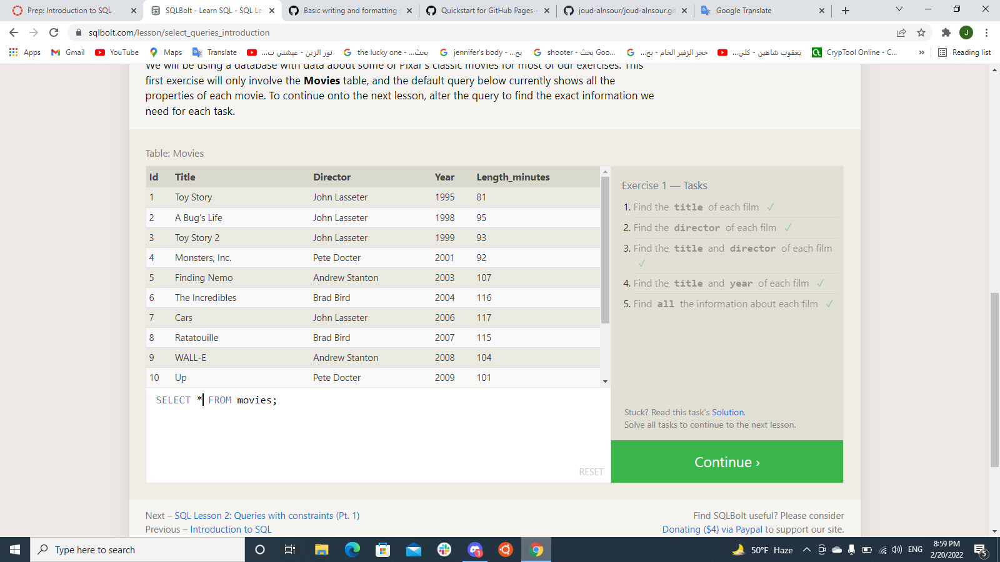
## Exercise 2
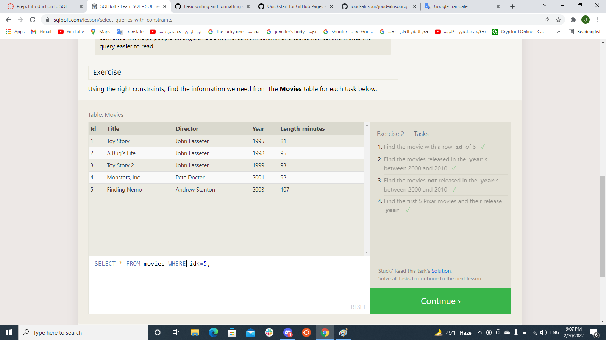
## Exercise 3
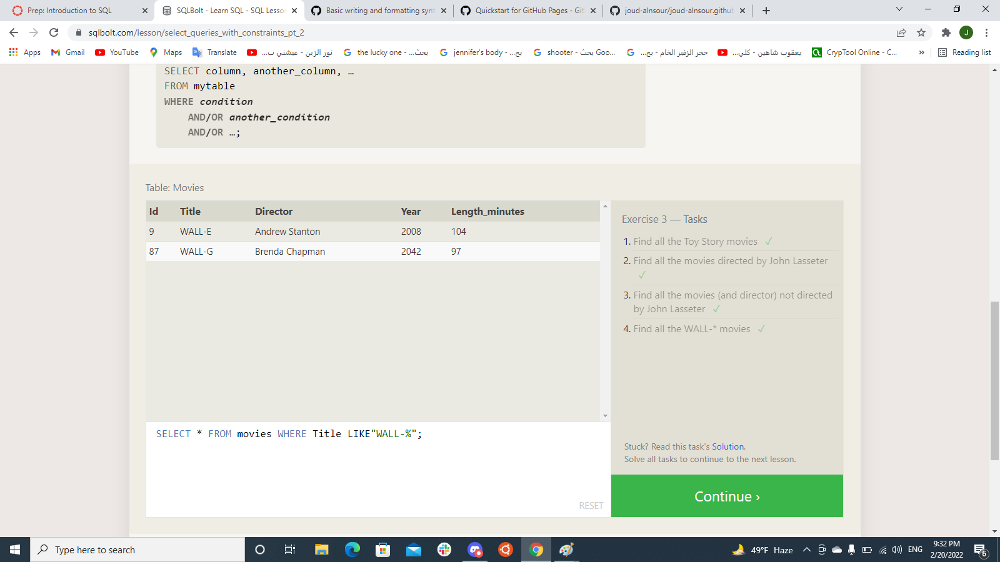
## Exercise 4
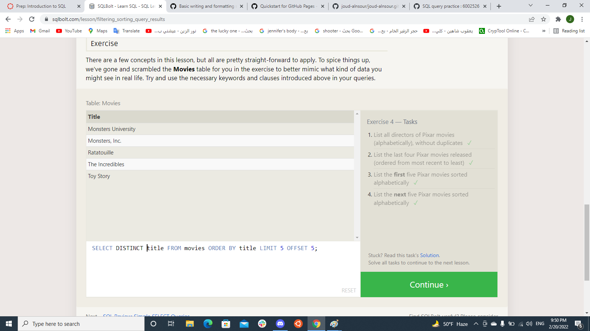
## Exercise 5
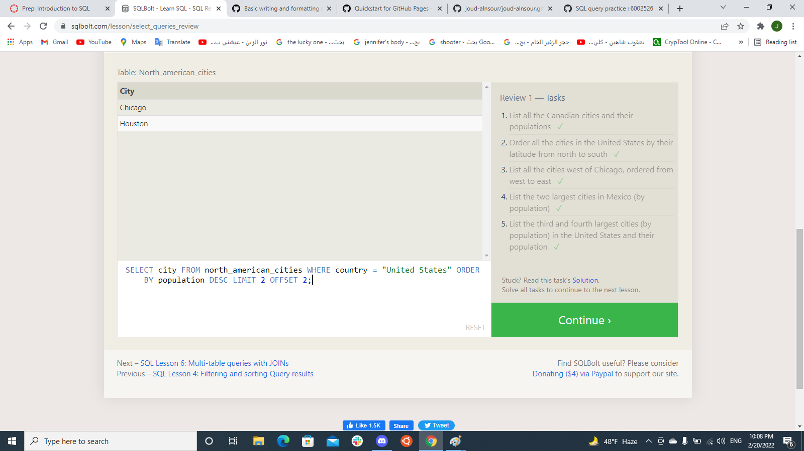
## Exercise 6
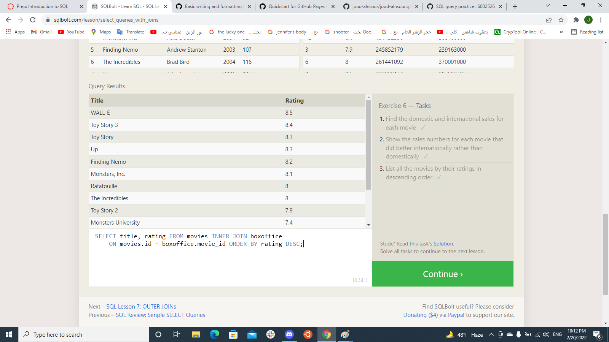
## Exercise 13
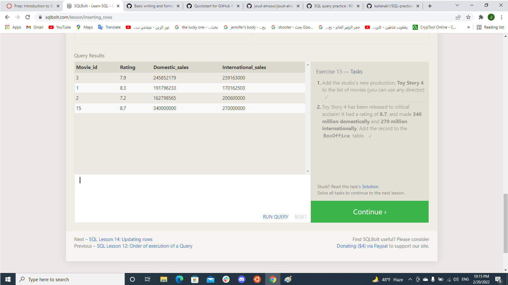
## Exercise 14
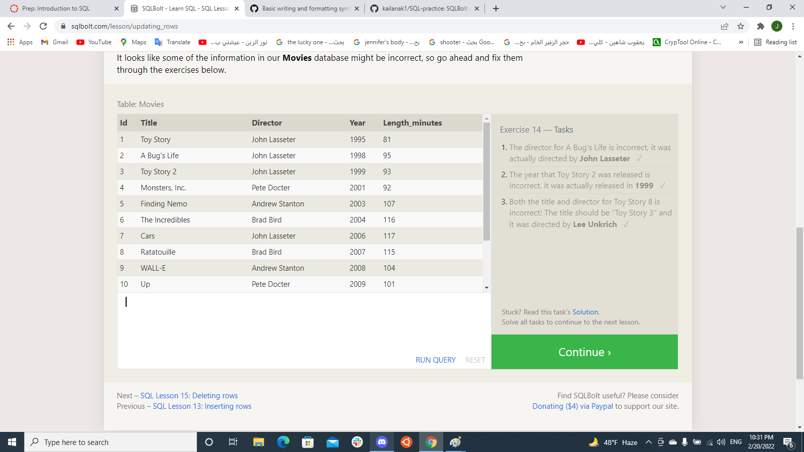
## Exercise 15
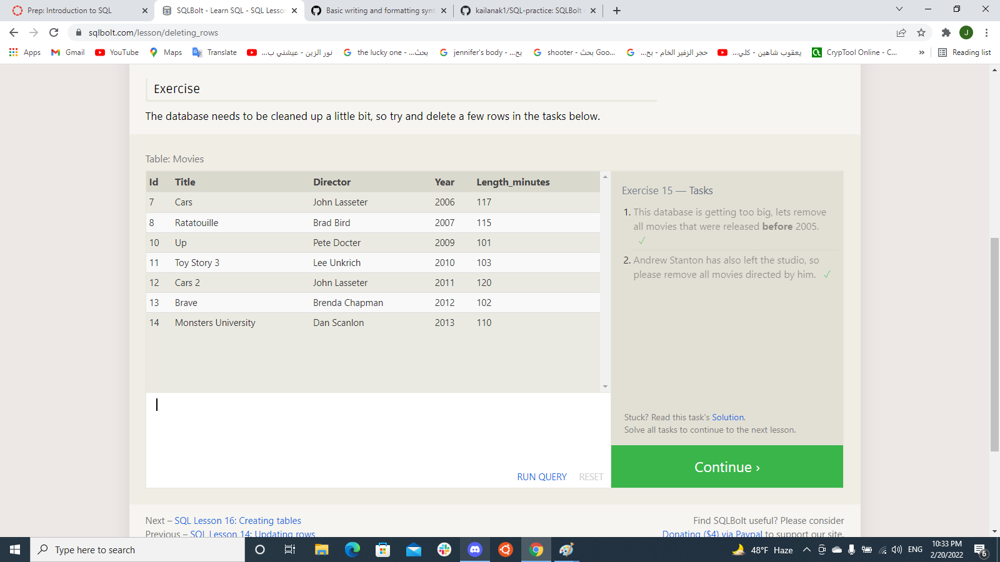
## Exercise 16
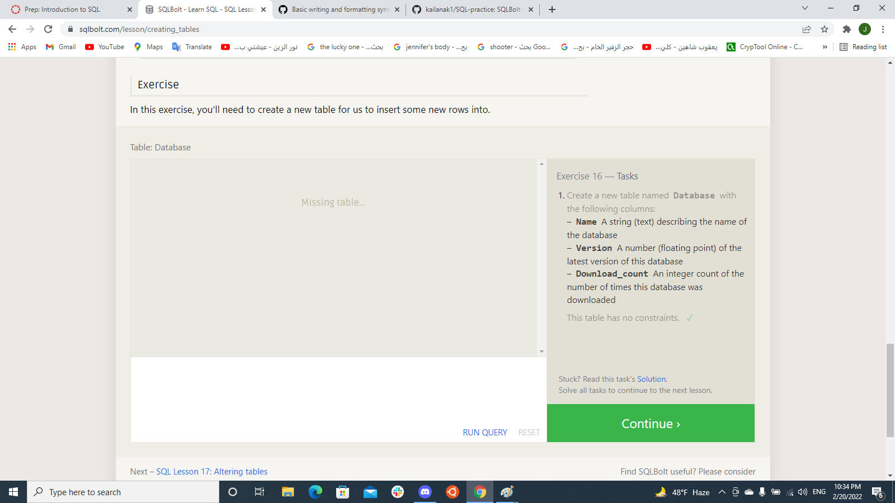
## Exercise 17
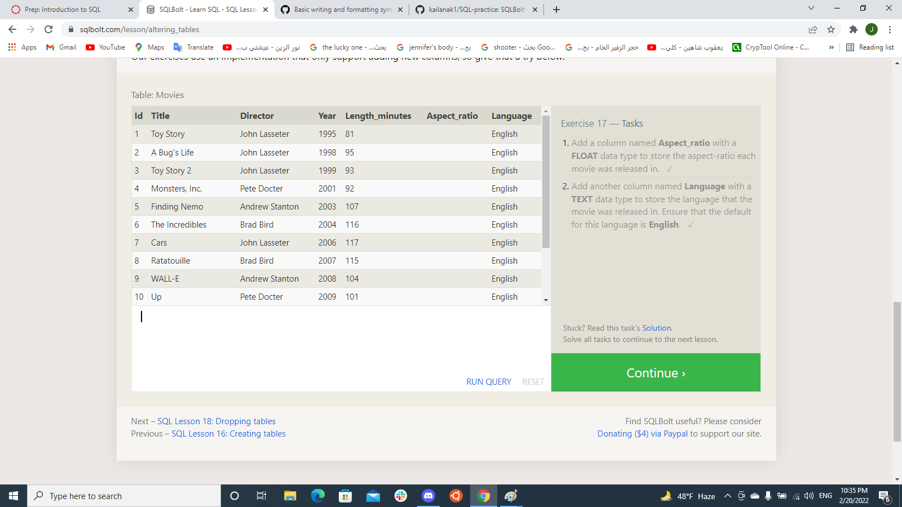
## Exercise 18
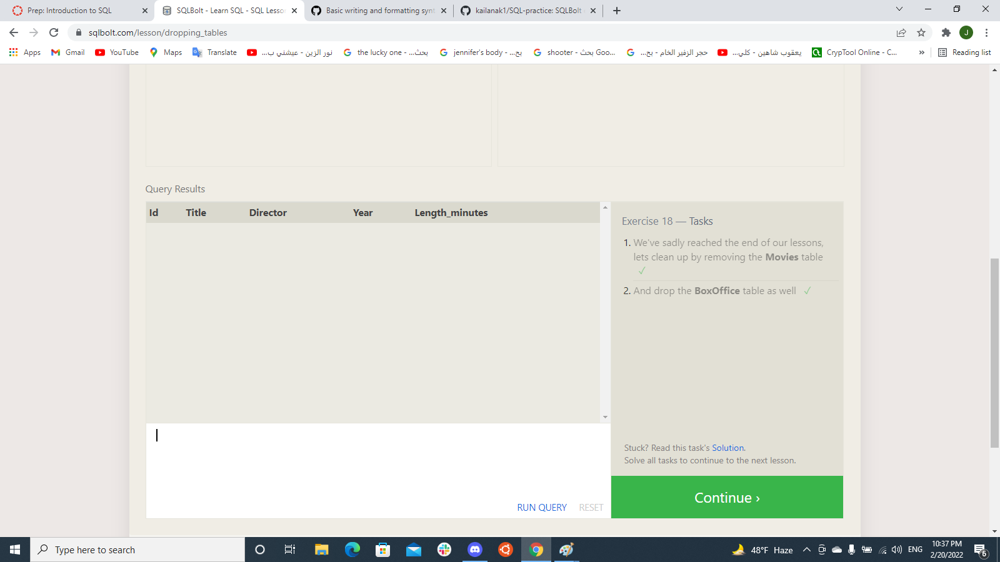